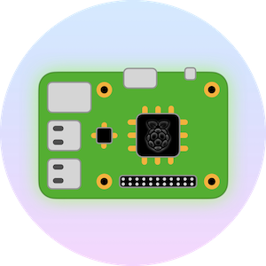

# raspberrypi
> Scripts and Guides for my RaspberryPis



## Contents

- [Initialization](#Initialization)
- [Install Docker](#Install-Docker)
- [Install Swift](install-swift.md)
- [Mount External Harddrive](mount-external-hard-drive.md)

# Initialization

## local configuration

```
sudo raspi-config
```

 * set new password
 * set new hostname
 * expand filesystem

## update & upgrade system

```shell
sudo apt-get update -y && sudo apt-get upgrade -y && sudo apt-get install -y \
    vim \
    git
```

## OPTIONAL: remove unused package
```shell
sudo apt autoremove
```

## disable ssh local environment
```shell
sudo vim /etc/ssh/ssh_config

# comment out following line
SendEnv LANG LC_*
```

## install `ffmpeg`
```shell
sudo apt-get install ffmpeg
```

</br>
</br>

# Install Docker

```shell
$ sudo apt-get install -y docker.io docker-compose lazydocker

$ sudo groupadd docker && sudo usermod -aG docker $USER
```

> Reboot
